# CLAUDE.md — NLQL

> 本文件是给 AI 协作者的**根级上下文**。模块细节请进入对应模块的 `CLAUDE.md`。
> 生成时间：2026-07-05 13:31:58（首次初始化）。

## 项目愿景

**NLQL（Natural Language Query Language）** 是一个**面向 Agent / RAG 的语义检索中间件**：用一套 SQL 风格、语义清晰的查询语言（及其等价的结构化 IR），在纯文本、自持索引与外部向量库之上提供统一、可解释、高性能的检索能力。

- PyPI 包名 `python-nlql`（import 名 `nlql`）；v0.2.0，发布前预览，允许 breaking change。
- 定位：把 SQL 的**确定性逻辑**与向量检索的**模糊语义**融合进一条语句。
- 规范形态：可 JSON 序列化的 `Query IR`；**三种入口等价编译到同一 IR**——NLQL 字符串、Python Query Builder、LLM function-calling。
- 目标用户：Agent / RAG 应用开发者。

四项关键决策（v2 重构）：

1. **技术栈**：核心依赖仅 `numpy + lark + httpx`（处处可装）；本地 ANN = 纯 numpy `FlatIndex`（精确、零原生依赖）；`hnswlib/faiss/qdrant/chroma/pgvector` 为可选 extras。
2. **混合引擎**：`Store` 抽象 + `StoreCaps` 能力声明；下推 = "适配器把查询翻译成后端原生查询"，后端表达不了的部分在内存兜底。
3. **Agent 面向**：IR 即 function-calling 载体；`engine.function_tool()` 直接产出 OpenAI 风格 tool 定义；`engine.explain()` 给开发者/Agent 信任基础。
4. **多模态**：`Payload{modality}` 从第一天起模态无关；`MultimodalEmbedder`（embed + embed_images 同空间）让文本 query 检索图像，IR/索引路径不变。

## 架构总览

```
Integration / SDK 层   ── Python SDK · Query Builder · NLQL 字符串 · LLM function-calling schema
                                   │ 编译到
                                   ▼
                              Query IR  (规范形态、可 JSON 序列化、可 EXPLAIN)
        写入路径                      │ 查询路径
  Ingestion Pipeline            Planner  →  Executor
   Normalizer                    · 拆分 下推(pushdown) vs 内存(in-memory)
   Splitter(可插拔)              · 向量召回(ANN top-k) → 谓词过滤 → 精排/重排
   Embedder(带缓存)              · 粒度变换(SENTENCE/SPAN)
   Indexer
                                   │
                                   ▼
              Store 层 (统一接口): LocalStore + Faiss/Hnsw/Qdrant/Chroma/PgVector 适配器
                                   ▲
                          Registry (统一注册: function/splitter/embedder/modality)
```

**分层职责**：SDK 全部编译到 IR；IR 是规范中间表示；Ingestion 写入时完成 normalize→split→embed(cache)→index；Planner 把 IR 拆成"能下推"与"必须内存算的"；Store 是数据/索引持有者；Registry 是所有扩展点的单一注册中心。

## 模块结构图

```mermaid
graph TD
    A["(根) NLQL"] --> SDK["sdk<br/>(Engine + QueryBuilder)"]
    A --> LANG["lang<br/>(NLQL 字符串 → IR)"]
    A --> IR["ir<br/>(Query IR + JSON Schema)"]
    A --> EMBED["embed<br/>(Embedder 协议 + 后端 + 缓存)"]
    A --> INGEST["ingest<br/>(写入管线 + 分词)"]
    A --> STORE["store<br/>(Store 协议 + 6 后端)"]
    A --> PLAN["plan<br/>(Planner + 下推拆分)"]
    A --> EXEC["exec<br/>(Evaluator + Executor)"]
    A --> RERANK["rerank<br/>(召回+精排)"]
    A --> LOADERS["loaders<br/>(文档加载)"]
    A --> MODEL["model<br/>(Payload/Document/Unit)"]
    A --> REGISTRY["registry<br/>(统一注册)"]
    A --> TYPES["types<br/>(TypeTag + Signature)"]
    A --> ERRORS["errors<br/>(异常层级)"]

    click SDK "./src/nlql/sdk/CLAUDE.md" "查看 sdk 模块文档"
    click LANG "./src/nlql/lang/CLAUDE.md" "查看 lang 模块文档"
    click IR "./src/nlql/ir/CLAUDE.md" "查看 ir 模块文档"
    click EMBED "./src/nlql/embed/CLAUDE.md" "查看 embed 模块文档"
    click INGEST "./src/nlql/ingest/CLAUDE.md" "查看 ingest 模块文档"
    click STORE "./src/nlql/store/CLAUDE.md" "查看 store 模块文档"
    click PLAN "./src/nlql/plan/CLAUDE.md" "查看 plan 模块文档"
    click EXEC "./src/nlql/exec/CLAUDE.md" "查看 exec 模块文档"
    click RERANK "./src/nlql/rerank/CLAUDE.md" "查看 rerank 模块文档"
    click LOADERS "./src/nlql/loaders/CLAUDE.md" "查看 loaders 模块文档"
    click MODEL "./src/nlql/model/CLAUDE.md" "查看 model 模块文档"
    click REGISTRY "./src/nlql/registry/CLAUDE.md" "查看 registry 模块文档"
    click TYPES "./src/nlql/types/CLAUDE.md" "查看 types 模块文档"
    click ERRORS "./src/nlql/CLAUDE.md#errors" "查看 errors 单文件模块文档"
```



## 模块索引

| 模块 | 路径 | 一句话职责 |
|---|---|---|
| [sdk](src/nlql/sdk/CLAUDE.md) | `src/nlql/sdk` | 高层 SDK：`Engine`（依赖注入入口）+ 流式 Query Builder |
| [lang](src/nlql/lang/CLAUDE.md) | `src/nlql/lang` | NLQL 字符串前端：lark 文法 + transformer + parser → IR |
| [ir](src/nlql/ir/CLAUDE.md) | `src/nlql/ir` | Query IR：规范 AST 节点 + JSON 序列化 + JSON Schema 导出 |
| [embed](src/nlql/embed/CLAUDE.md) | `src/nlql/embed` | Embedder 协议 + 后端（Fake/OpenAI/ST/Doubao/CLIP）+ 缓存 |
| [ingest](src/nlql/ingest/CLAUDE.md) | `src/nlql/ingest` | 写入管线：normalizer + 可插拔 splitter + indexer |
| [store](src/nlql/store/CLAUDE.md) | `src/nlql/store` | Store 协议 + LocalStore + 5 个适配器 + 列式过滤 |
| [plan](src/nlql/plan/CLAUDE.md) | `src/nlql/plan` | 查询规划：分数提取 + QueryPlan + 下推拆分 |
| [exec](src/nlql/exec/CLAUDE.md) | `src/nlql/exec` | 执行：表达式求值器（无特判）+ Executor（召回→过滤→重排→limit） |
| [rerank](src/nlql/rerank/CLAUDE.md) | `src/nlql/rerank` | 两段式检索：可插拔 Reranker + Fake + CrossEncoder |
| [loaders](src/nlql/loaders/CLAUDE.md) | `src/nlql/loaders` | 文档加载器（.txt/.md/.docx/.pdf，按扩展名分派） |
| [model](src/nlql/model/CLAUDE.md) | `src/nlql/model` | 模态无关数据模型：Payload / Document / Unit / Vector |
| [registry](src/nlql/registry/CLAUDE.md) | `src/nlql/registry` | 统一能力注册中心（function/splitter/embedder/modality） |
| [types](src/nlql/types/CLAUDE.md) | `src/nlql/types` | 类型系统：TypeTag 枚举 + 函数 Signature |
| [errors](src/nlql/CLAUDE.md#errors) | `src/nlql/errors.py`（单文件模块） | 类型化异常层级，根 `NLQLError` |

## 运行与开发

### 安装

```bash
pip install python-nlql              # 核心：numpy + lark + httpx
pip install "python-nlql[local]"     # 可选：sentence-transformers / CLIP / cross-encoder
pip install "python-nlql[faiss]"     # 可选：Faiss 后端
pip install "python-nlql[hnsw]"      # 可选：hnswlib 后端（sublinear ANN）
pip install "python-nlql[qdrant]"    # 可选：Qdrant 后端
pip install "python-nlql[chroma]"    # 可选：Chroma 后端
pip install "python-nlql[pgvector]"  # 可选：Postgres + pgvector
pip install "python-nlql[segment]"   # 可选：pysbd 鲁棒分句
pip install "python-nlql[loaders]"   # 可选：DOCX / PDF 加载
pip install "python-nlql[dev]"       # 开发：pytest + pytest-cov + ruff + mypy
```

### 开发循环

```bash
. .venv/Scripts/Activate.ps1          # Windows
pytest                                # 跑全部 293 测试
pytest --cov=nlql --cov-report=term   # 验收覆盖率（目标 90%）
ruff check .                          # lint
mypy src/nlql                         # strict 类型检查
python benchmarks/bench.py [n_docs]   # 性能基准（用 FakeEmbedder）
```

> Python 版本下限 **3.11**（`pyproject.toml` 要求），已在 3.14 验证。

### 文档站（`docs/`，Fumadocs 子工程）

独立的 **Fumadocs (Next.js)** 文档子工程，与 Python 主仓隔离（自有 `package.json` / `tsconfig` / `node_modules`）。具备 `llms.txt`/`llms-full.txt`、Ask AI（Anthropic）、中英双语结构。

```bash
cd docs && pnpm install     # 首次安装（需 pnpm 10+）
pnpm dev                    # 启动 dev server → http://localhost:3000
pnpm build                  # 生产构建验证
```

- 路由：`/docs/zh`（中文实质内容）、`/docs/en`（英文占位）、`/llms.txt`、`/llms-full.txt`。
- Ask AI：在 `docs/.env.local` 配 `ANTHROPIC_API_KEY=` 后生效（默认 `claude-sonnet-5`）；未配时返回 503，其余功能不受影响。
- 内容在 `docs/content/docs/{zh,en}/`，侧边栏顺序由各目录 `meta.json` 控制；新增页面需重启 `pnpm dev` 让 Fumadocs 重新扫描。
- 详见 [`docs/README.md`](docs/README.md)。

### 三入口等价性（核心契约）

```python
# 入口 A：NLQL 字符串
engine.search('SELECT SENTENCE LET rel = SIMILARITY(content, "x") WHERE rel >= 0.8 LIMIT 5')
# 入口 B：Query Builder
QueryBuilder.select("sentence").let("rel", similarity("content","x")).where(F("rel")>=0.8).limit(5)
# 入口 C：LLM IR（function-calling）
engine.search_ir({"select":..., "let":..., "where":..., "limit":5})
```

三者编译到同一 `Query IR`，结果逐条一致（有测试保证）。

## 测试策略（硬要求）

- **每个模块伴随 `tests/test_*`**——当前 26 个测试文件覆盖全部 13 个有逻辑的子模块（见 `.claude/index.json` 列表）。
- **用假 embedder 避免外部依赖**：`FakeEmbedder`（确定性、离线、跨进程稳定）+ `FakeMultimodalEmbedder` + `FakeReranker`；`tests/conftest.py` 提供 `fake_embedder` fixture（dim=64）。
- **跨后端一致性**：`test_cross_store.py` 断言同一查询在 Local/Faiss/Hnsw/Qdrant/Chroma 上结果逐条一致。
- **覆盖率验收**：`pytest --cov`，当前 **293 测试 / 90% 覆盖率**，mypy strict、ruff 全过。

## 编码规范

- **mypy strict**（`python_version = "3.12"`，因 numpy 2.x 类型 stub 用 3.12 语法；自身代码保持 3.11 兼容，只用 `X | Y` 与 `StrEnum`）：`disallow_untyped_defs`、`disallow_incomplete_defs`、`check_untyped_defs`、`strict_equality` 全开。
- **ruff**：`line-length=100`，`target-version="py311"`，select `E/W/F/I/B/C4/UP`，ignore `E501/B008/C901`；`__init__.py` 忽略 `F401`。
- **风格**：模块 docstring 说明"是什么 / 解决什么"；优先 `Protocol` + 依赖注入，反对工厂方法膨胀；public API 全部走 `__all__`。

### API 设计哲学（务必遵循）

1. **底层可扩展（依赖注入 / Protocol oriented），便利上层封装**——embedder/store/reranker/splitter/loader 全是注入点。
2. **反对 `with_a/with_b` 工厂方法膨胀**：`Engine(embedder)` 是**唯一**构造方式，没有 `with_openai/with_fake` 等渠道专属构造；任何 OpenAI 兼容渠道 = `OpenAIEmbedder(base_url=...)`；其它厂商 = 一个新的 `Embedder` 实现。
3. **Store 层直连向量库**：Qdrant/Chroma/PgVector 各自用**自己后端的原生能力**实现 `ann_search + 过滤 + limit`；"下推"是适配器的**内部细节**，不是独立子系统——能整条委托就委托，不能才拆分残余。

### 语义原则（KISS / 正交）

- **无 special-case**：`SIMILARITY`/`meta.*`/`CONTAINS`/自定义函数都是普通 IR 节点；区别只在"能否下推"与"求值代价"，由 Planner 决定，不由 evaluator 用 if-else 区分。
- **`SIMILARITY` = provider 型函数**（`provides_score=True`），值由召回阶段 `matmul` 一次性写入 `unit.scores[canonical(call)]`，求值器**唯一的分支**是 `cap.provides_score`。
- **语义正交**：字段路径 / 标量函数 / 谓词 / 逻辑组合正交；求值走单一路径。
- **相似度用原始 cosine ∈ [-1,1]**，不做 `(cos+1)/2` 折叠（保证阈值透明）。

## AI 使用指引

- 改动前**先读对应模块的 `CLAUDE.md`** 拿到接口契约与关键文件。
- 新增能力（函数/分词/embedder/模态）→ 走 `registry.register(...)`，**不要改文法**；新增后端 → 实现 `Store` Protocol + `StoreCaps`。
- 三入口的等价性是契约——改 IR/parser/builder/executor 任一处都要保证其它两路 round-trip 不变，并加/跑跨后端与跨入口测试。
- 任何 PR 前必须：`pytest --cov` ≥ 90% 且全绿、`ruff check .` 干净、`mypy src/nlql` 无告警。
- `DESIGN.md` §1 列出了 v1（PoC）的 8 类缺陷——**不要把它们写回来**（重算 embedding / 假算子 / 特判 / 类型死代码 / 散落 adapter / 全系统 `content:str` / 标点正则分词）。

## 关键参考文件

- 设计奠基：[`DESIGN.md`](DESIGN.md)（v2 完整设计，含 §0–§17）
- 用户向 README：[`README.md`](README.md)
- 性能基准与 M6 决策：[`benchmarks/README.md`](benchmarks/README.md)
- 包元数据：[`pyproject.toml`](pyproject.toml)
- 扫描索引：[`.claude/index.json`](.claude/index.json)

## 变更记录 (Changelog)

- **2026-07-05 13:31:58** — 首次初始化：生成根 `CLAUDE.md` + 13 个子模块 `CLAUDE.md`（含包总览 `src/nlql/CLAUDE.md` 收录单文件 `errors` 模块）+ `.claude/index.json`，含 Mermaid 结构图与面包屑导航。
