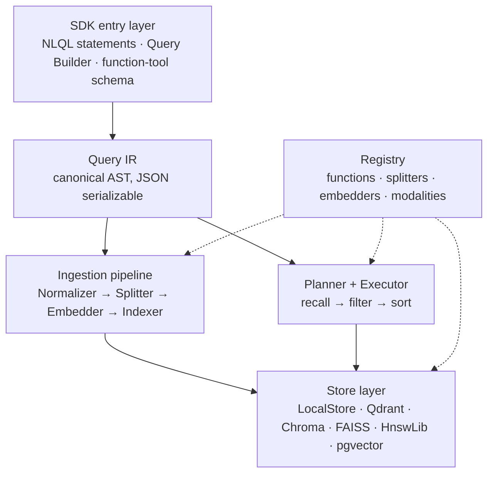

# Architecture

NLQL is composed of six layers, each with a single, clearly bounded responsibility. All user-facing entry points ultimately compile to the same Query IR, and the two data flows — ingestion and query — converge at the Store layer.



## Responsibilities of each layer

**The SDK entry layer** provides three ways to construct a query: NLQL strings, a Python chained Builder, and a JSON Schema for LLM tool calls. All three compile to the same IR, producing identical results.

**Query IR** is the canonical form of a query — a JSON-serializable AST. It is independent of how the query was constructed and independent of the underlying storage. The output of `engine.explain()` is this tree plus planning information.

**The ingestion pipeline** runs four steps on `engine.add()` / `engine.add_text()`: text normalization, splitting by a pluggable splitter, vectorization (with caching), and writing to the Store index. The splitter also serves granularity transformation at query time, avoiding ad-hoc re-splitting during queries.

**Planner + Executor** translates the IR into an execution plan: first fetch candidates from the index by relevance, then apply predicate filters, and finally sort and cap. When a Reranker is configured, it re-ranks candidates before the limit is applied.

**The Store layer** holds data and indexes. `LocalStore` is the built-in pure-Python implementation; Qdrant, Chroma, and other `ExternalStore` adapters translate filter conditions into their respective backends' native queries, so data is processed as close to the backend as possible.

**Registry** is the single registration center, uniformly managing four categories of extension points: functions, splitters, embedders, and modalities. Built-in capabilities and user extensions follow the same path — once registered, they are usable in queries.

## Ingestion data flow

Text entering the system becomes vectorized units that can be retrieved:

```python
engine.add_text("AI agents plan tasks and call tools.", metadata={"status": "published"})
```

The following runs internally:

1. **Normalize**: unify whitespace, line breaks, etc.
2. **Split**: split into multiple `Unit`s at the configured granularity (default: by sentence)
3. **Vectorize**: compute the embedding for each Unit's content; results are cached by content hash
4. **Index**: write the Unit together with its vector and metadata to the Store

Once ingestion completes, the vectors already live in the index. The query stage never recomputes embeddings.

## Query data flow

```python
engine.search('SELECT SENTENCE LET rel = SIMILARITY(content, "agents") WHERE rel >= 0.5 LIMIT 5')
```

Execution steps:

1. **Parse**: the NLQL string or Builder object compiles into a Query IR
2. **Plan**: the Planner extracts relevance calls and determines the recall strategy
3. **Recall**: perform a single matrix multiplication between the query vector and index candidates to obtain cosine scores
4. **Filter**: apply the non-semantic conditions in `WHERE` (metadata, string containment, etc.)
5. **Sort and cap**: order by `ORDER BY` and take `LIMIT` rows
6. **Rerank** (optional): if a Reranker is configured, re-rank candidates before capping

External Store adapters translate the filter conditions they can express into native backend queries, so the backend returns only the hit vectors; parts that cannot be expressed (such as custom Python function predicates) are filtered in memory afterwards. Regardless of the backend, the same query returns identical results — only performance characteristics differ.

## Debugging

`engine.explain(query)` returns the parsed IR, the Planner's execution plan, and the estimated cost, useful for diagnosing query behavior:

```python
import json
print(json.dumps(engine.explain(query), indent=2, ensure_ascii=False))
```

## Next steps

- [Query syntax](./syntax.md): how to write each clause
- [Three forms](./three-entries.md): equivalence of the three entry points
- [Data model](./data-model.md): the relationship between Document, Payload, and Unit
- [Hybrid backends](../tutorials/hybrid-stores.md): switching and combining external stores
