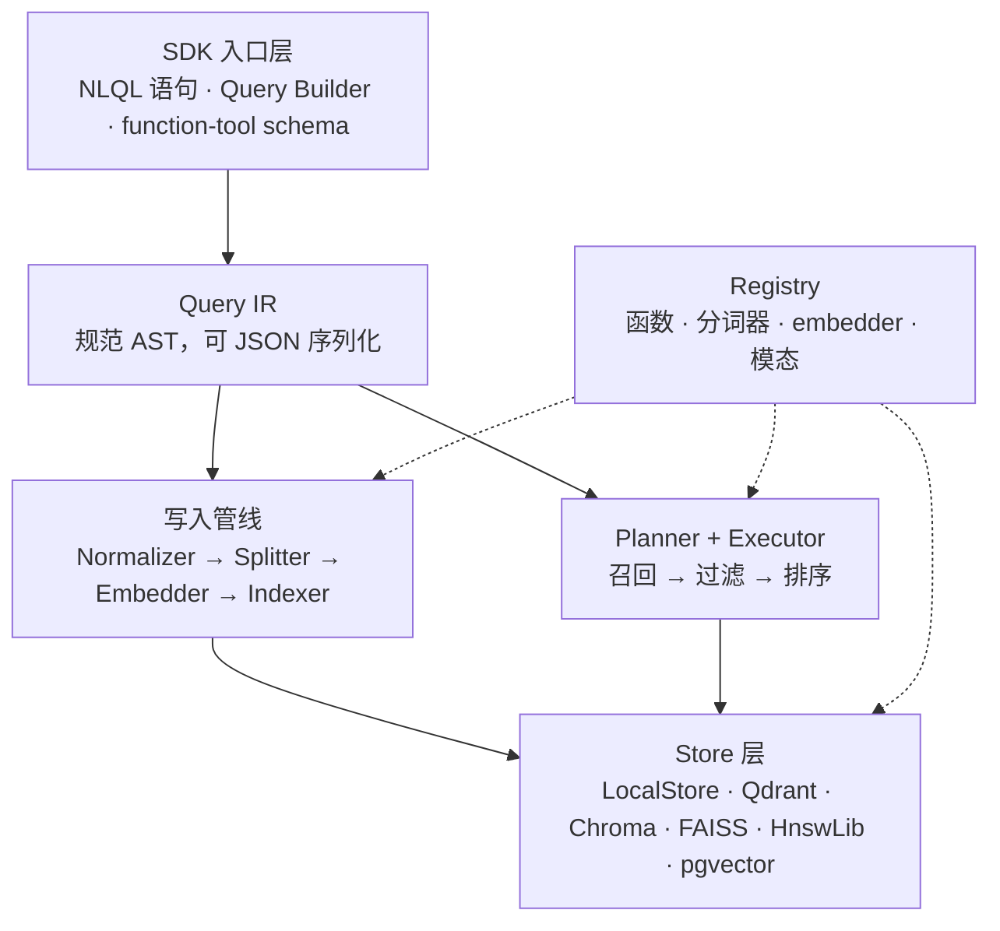

# 架构

NLQL 由六层组成，每层职责单一、边界清晰。所有面向使用者的入口最终都编译到同一份 Query IR，写入与查询两条数据流在 Store 层汇合。



## 各层职责

**SDK 入口层** 提供三种构造查询的方式：NLQL 字符串、Python 链式 Builder、用于 LLM 工具调用的 JSON Schema。三者编译到同一份 IR，结果逐条一致。

**Query IR** 是查询的规范形态——一棵可 JSON 序列化的 AST。它独立于构造方式，也独立于底层存储。`engine.explain()` 输出的就是这棵树加上规划信息。

**写入管线** 在 `engine.add()` / `engine.add_text()` 时执行四步：文本归一化、按可插拔分词器切分、向量化（带缓存）、落入 Store 索引。切分器同时服务于查询时的粒度变换，避免在查询时临时重新切分。

**Planner + Executor** 把 IR 翻译成执行计划：先按相关度从索引中取候选，再用谓词过滤，最后排序限量。配置了 Reranker 时，在限量前对候选做精排。

**Store 层** 持有数据与索引。`LocalStore` 是纯 Python 的内置实现；Qdrant、Chroma 等 `ExternalStore` 适配器把过滤条件翻译成各自后端的原生查询，让数据尽可能在后端就近处理。

**Registry** 是单一注册中心，统一管理函数、分词器、embedder、模态四类扩展点。内置能力与用户扩展走同一路径，注册后即可在查询中使用。

## 写入数据流

文本进入系统后变成可被检索的向量化单元：

```python
engine.add_text("AI agents plan tasks and call tools.", metadata={"status": "published"})
```

内部依次执行：

1. **归一化**：统一空白、换行等
2. **切分**：按配置粒度（默认按句）切成多个 `Unit`
3. **向量化**：对每个 Unit 的内容计算 embedding，结果按内容哈希缓存
4. **落索引**：Unit 连同向量与元数据写入 Store

写入完成后，向量已经存在索引里。查询阶段不再重复计算 embedding。

## 查询数据流

```python
engine.search('SELECT SENTENCE LET rel = SIMILARITY(content, "agents") WHERE rel >= 0.5 LIMIT 5')
```

执行步骤：

1. **解析**：NLQL 字符串或 Builder 对象编译成 Query IR
2. **规划**：Planner 提取其中的相关度调用，确定召回策略
3. **召回**：用查询向量与索引中的候选做一次矩阵乘法，得到 cosine 分数
4. **过滤**：应用 `WHERE` 中的非语义条件（元数据、字符串包含等）
5. **排序限量**：按 `ORDER BY` 排序，取 `LIMIT` 条
6. **重排**（可选）：若配置了 Reranker，对候选做精排后再限量

外部 Store 适配器会把能表达的过滤条件翻译成后端原生查询，让后端只返回命中向量；无法表达的部分（如自定义 Python 函数谓词）在内存中后置过滤。无论使用哪个后端，同一查询返回的结果一致，只是性能特征不同。

## 调试

`engine.explain(query)` 返回解析后的 IR、Planner 的执行计划与预估代价，用于排查查询行为：

```python
import json
print(json.dumps(engine.explain(query), indent=2, ensure_ascii=False))
```

## 下一步

- [查询语法](./syntax.md)：每个子句的写法
- [三种写法](./three-entries.md)：三种入口的等价性
- [数据模型](./data-model.md)：Document、Payload、Unit 的关系
- [混合后端](../tutorials/hybrid-stores.md)：切换与组合外部存储
